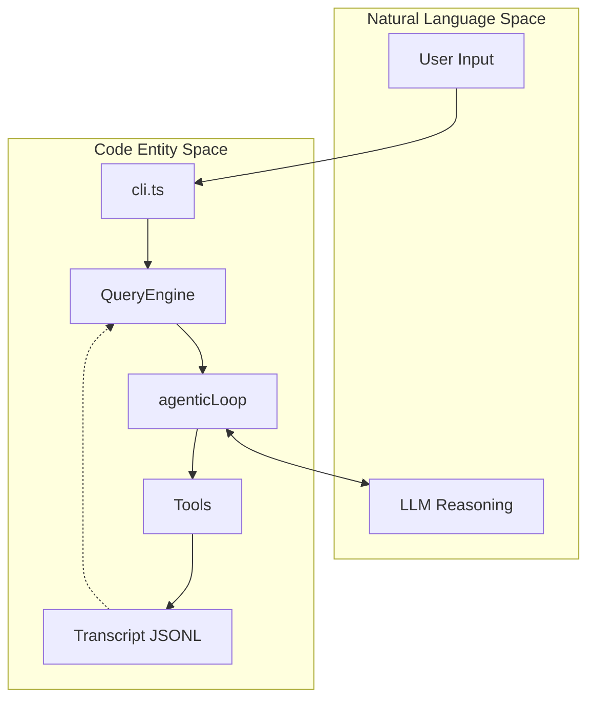
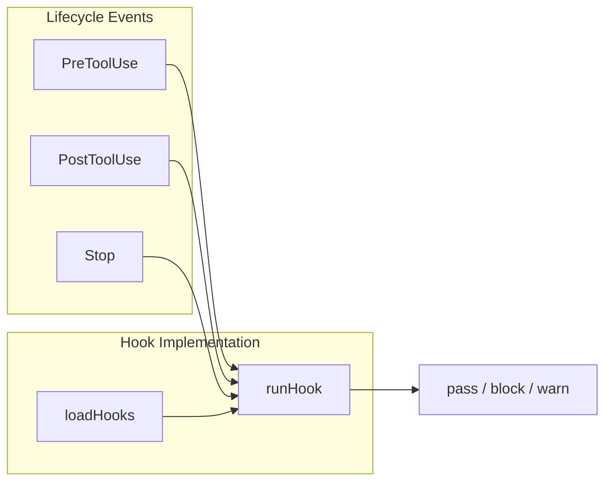

# agent-cli

A terminal-based autonomous coding agent. Sessions persist under `~/.agent`.

`agent-cli` assists developers with complex tasks through a suite of filesystem, shell, and external tools. It maintains persistent session state, uses the Anthropic Claude API for reasoning, and enforces a permission system for safe execution of destructive actions.

Built as a Node.js application using the `ink` React-based framework for its terminal UI.

## Run

```bash
npm install
```

Put `ANTHROPIC_AUTH_TOKEN` in `.env`.

```bash
npm run dev
```

## Features

- File, search, and shell tools (`Read`, `write_file`, `edit_file`, `grep`, `glob`, `bash`)
- Permission prompts on writes and unknown shell commands (`y` / `n` / `a`)
- Plan mode, in-session todos, and a persistent task graph (`/tasks`)
- MCP servers, Markdown skills (`SKILL.md`), and lifecycle hooks
- Config in `~/.agent/settings.json` and `.agent/settings.json`

Slash commands: `/help`, `/clear`, `/compact`, `/cost`, `/model`, `/history`, `/memory`, `/tasks`.

## System Workflow

1. **Initialization** — the CLI loads configs, initializes `McpManager`, and loads local Markdown skills.
2. **Session Orchestration** — the `QueryEngine` manages message history and token budget.
3. **Agentic Loop** — the system alternates model inference and tool execution until the task is complete or budget exhausted.
4. **Persistence** — every interaction, tool result, and compaction event is logged to a JSONL transcript in `~/.agent`.



## Lifecycle Hooks

The `executeHooks` function coordinates execution of external commands at lifecycle points such as `PreToolUse`, `PostToolUse`, and `Stop`. Hooks can return a decision to `pass`, `block`, or `warn`, and can inject additional text into the agent's context.



## Directory Layout

| Component | Location | Description |
| :--- | :--- | :--- |
| **Entrypoint** | `src/entrypoint/cli.ts` | Handles CLI flags, session restoration, and UI mounting. |
| **Hooks** | `src/hooks/` | Manages external script integration and lifecycle triggers. |
| **Persistence** | `src/persistence/` | Handles JSONL transcript logging and session state recovery. |
| **Skills** | `src/skills/` | Loads Markdown-based specialized agent behaviors. |
| **UI** | `src/ui/` | React/Ink components for the terminal interface. |
